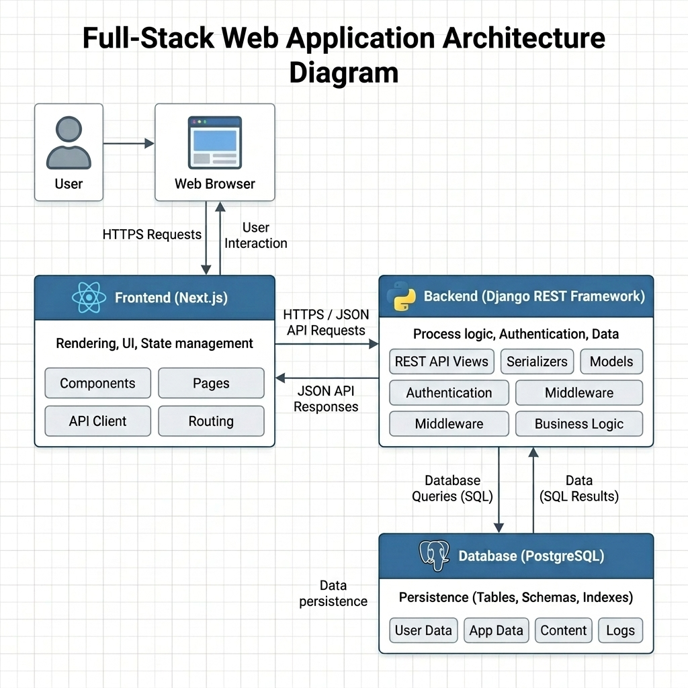
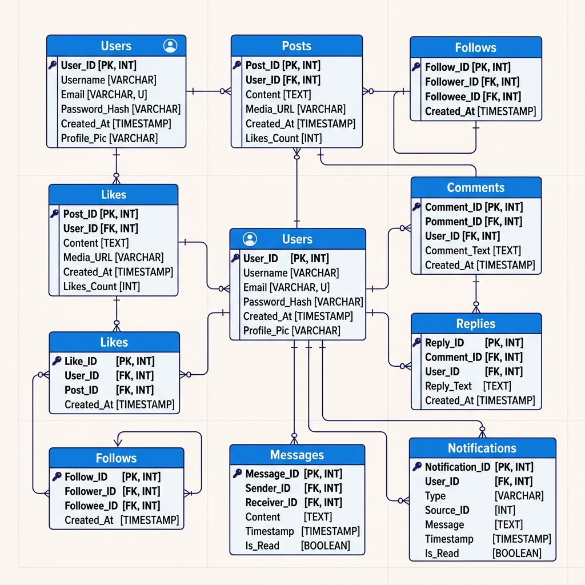

# SocialApp Documentation

## Project Overview
SocialApp is a full-stack social media application featuring a real-time feed, image-supported posts, nested comments/replies, and a comprehensive reaction system.

## Tech Stack

### Backend
- **Framework**: Django 4.2 + Django REST Framework (DRF)
- **Authentication**: JWT (JSON Web Tokens) via `djangorestframework-simplejwt`
- **Database**: PostgreSQL (handling large-scale data with indexing and UUIDs)
- **Image Processing**: Pillow (handling user-uploaded post images)
- **Pagination**: Cursor-based pagination for high-performance feed loading

### Frontend
- **Framework**: Next.js (React)
- **Styling**: Vanilla CSS (Custom social UI) + Bootstrap for layout
- **State Management**: React Context API (`AuthContext`)
- **API Interaction**: Axios with interceptors for automatic token attachment and refresh logic
- **Utility**: `js-cookie` for secure client-side session management

---

## Key Decisions & Implementation Details

### 1. Authentication Flow
We used a **JWT-based stateless architecture**. 
- The frontend stores the `access_token` and `refresh_token` in cookies.
- An Axios interceptor automatically detects `401 Unauthorized` responses and attempts to use the refresh token to get a new access token without interrupting the user session.
- **Protected Routes**: The `/feed` page is client-side protected. If no valid user session is detected, the application automatically redirects to `/login`.

### 2. Social Feed Functionality
- **Newest First**: The feed is fetched from the backend using a `created_at DESC` ordering. The frontend re-fetches the feed upon post creation to ensure the new post appears at the top.
- **Visibility Control**: Users can set posts as `Public` (visible to everyone) or `Private` (visible only to the author). I added a visibility selector in the `PostCreate` component to make this functional.
- **Optimistic Updates**: To ensure the UI feels snappy, "Likes" and "Reactions" use optimistic updates—where the UI toggles immediately before the server confirms the request.

### 3. Interactive Components
- **Nested Comments**: Implementation supports a 1-level deep reply system (Comments -> Replies). This balances depth with performance and UI simplicity.
- **Likers Modal**: A reusable modal component was implemented to show exactly who reacted to a specific post, comment, or reply, enhancing the social "connection" aspect of the app.

---

## System Architecture

## Database Design

## Database Design Highlights
- **UUIDs everywhere**: All entities (Users, Posts, Comments) use UUIDs instead of sequential integers to prevent "ID scraping" and improve security.
- **Denormalized Counters**: `like_count` and `comment_count` are stored directly on the `Post` model. They are updated atomically using Django signals (`F()` expressions) to avoid race conditions. This ensures that the feed page doesn't have to run expensive aggregate queries every time it loads.

## Installation Summary
1. **Backend**: Setup a venv, install `requirements.txt`, configure `.env`, and run migrations. (See `/backend/README.md` for detail).
2. **Frontend**: Run `npm install` and `npm run dev`. (Ensure `NEXT_PUBLIC_API_URL` is set in `.env.local`).
