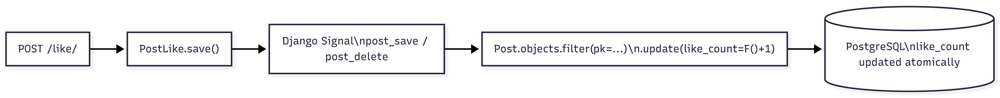

# SocialApp — Backend

REST API built with Django REST Framework and PostgreSQL.

**Repo:** https://github.com/harunurrashid97/socialapp

---

## Stack

- **Django 4.2 + DRF** — backend framework
- **PostgreSQL** — main database
- **SimpleJWT** — JWT auth with refresh token support
- **Pillow** — image uploads
- **Cursor-based pagination** — for stable, efficient feed loading

---

## Project Structure

```
backend/
├── socialapp/           # Django project config (settings, urls, wsgi)
├── apps/
│   ├── users/           # register, login, logout, me endpoints
│   ├── posts/           # post CRUD + feed
│   ├── comments/        # comments + replies
│   └── interactions/    # likes for posts, comments, replies
├── manage.py
├── requirements.txt
└── .env
```

---

## Architecture


### Auth Flow


### Like Counter Flow



---

## Design Decisions

**UUID primary keys** — used UUIDs instead of integers so post IDs can't be guessed or enumerated.

**Denormalized like/comment counters** — storing `like_count` and `comment_count` directly on the model avoids expensive aggregate queries on every feed load. They're updated atomically via Django signals using `F()` expressions so no race conditions.

**Cursor pagination** — offset-based pagination gets slow and stale as data grows. Cursor pagination stays stable and fast regardless of how many records exist.

**Private/public posts** — visibility is checked at the queryset level, not just in the view. Even if someone knows the UUID of a private post, they get a 404.

**JWT with refresh tokens** — access tokens expire in 60 minutes, refresh tokens in 7 days. Frontend auto-refreshes silently.

**One-level replies only** — kept replies at one level deep (comments → replies) to avoid recursive DB queries and keep the UI simple.

**No N+1 queries** — all list views use `select_related` / `prefetch_related`. Comment list also prefetches replies and their authors in one query.

---

## Setup

### 1. Clone and create venv

```bash
git clone https://github.com/harunurrashid97/socialapp.git
cd socialapp/backend
python3 -m venv venv
source venv/bin/activate
pip install -r requirements.txt
```

### 2. Create PostgreSQL database

```bash
sudo -u postgres psql
```
```sql
CREATE DATABASE socialapp_db;
ALTER USER postgres WITH PASSWORD 'yourpassword';
\q
```

### 3. Configure .env

```env
SECRET_KEY=<generate one>
DEBUG=True
DB_NAME=socialapp_db
DB_USER=postgres
DB_PASSWORD=yourpassword
DB_HOST=localhost
DB_PORT=5432
ACCESS_TOKEN_LIFETIME_MINUTES=60
REFRESH_TOKEN_LIFETIME_DAYS=7
```

Generate a secret key:
```bash
python3 -c "from django.core.management.utils import get_random_secret_key; print(get_random_secret_key())"
```

### 4. Migrate and run

```bash
python3 manage.py migrate
python3 manage.py createsuperuser
python3 manage.py runserver
```

API runs at `http://127.0.0.1:8000`  
Admin panel at `http://127.0.0.1:8000/admin/`

---

## API Endpoints

All requests need `Authorization: Bearer <access_token>` unless marked public.

### Auth — `/api/auth/`

| Method | Endpoint | Public | Notes |
|--------|----------|--------|-------|
| POST | `/register/` | ✓ | Returns tokens + user |
| POST | `/login/` | ✓ | Returns tokens + user |
| POST | `/logout/` | — | Invalidates refresh token |
| GET | `/me/` | — | Current user info |
| PUT | `/me/` | — | Update name |
| POST | `/token/refresh/` | ✓ | Get new access token |

Register body:
```json
{
  "first_name": "Alice",
  "last_name": "Smith",
  "email": "alice@example.com",
  "password": "pass123",
  "password_confirm": "pass123"
}
```

Response (login/register):
```json
{ "access": "<jwt>", "refresh": "<jwt>", "user": { "id": "...", "email": "...", "full_name": "Alice Smith" } }
```

---

### Posts — `/api/posts/`

| Method | Endpoint | Notes |
|--------|----------|-------|
| GET | `/` | Feed — public posts + own private posts, newest first |
| POST | `/` | Create post (use form-data if uploading image) |
| GET | `/mine/` | My posts only |
| GET | `/<id>/` | Single post |
| PUT | `/<id>/` | Edit (author only) |
| DELETE | `/<id>/` | Delete (author only) |

Fields: `content` (required), `image` (optional file), `visibility` (`public` or `private`)

---

### Comments — `/api/comments/`

| Method | Endpoint | Notes |
|--------|----------|-------|
| GET | `/posts/<post_id>/` | List comments |
| POST | `/posts/<post_id>/` | Add comment |
| PUT/DELETE | `/<id>/` | Edit/delete (author only) |
| GET | `/<comment_id>/replies/` | List replies |
| POST | `/<comment_id>/replies/` | Add reply |
| PUT/DELETE | `/replies/<id>/` | Edit/delete (author only) |

---

### Likes — `/api/interactions/`

| Method | Endpoint | Notes |
|--------|----------|-------|
| POST | `/posts/<id>/like/` | Toggle like |
| GET | `/posts/<id>/likers/` | Who liked it |
| POST | `/comments/<id>/like/` | Toggle like |
| GET | `/comments/<id>/likers/` | Who liked it |
| POST | `/replies/<id>/like/` | Toggle like |
| GET | `/replies/<id>/likers/` | Who liked it |

Like toggle response: `{ "liked": true, "like_count": 5 }`

---

## Testing with Postman

1. Create environment with `base_url = http://127.0.0.1:8000`
2. After login/register, save tokens in Tests tab:
```javascript
const res = pm.response.json();
pm.environment.set("access_token", res.access);
pm.environment.set("refresh_token", res.refresh);
```
3. Set collection Authorization to `Bearer {{access_token}}`

**Test private visibility:** Register two users, create a private post as user A, try to fetch it as user B — should get `404`.

---

## Common Errors

| Error | Likely cause |
|-------|-------------|
| `401` | Token missing or expired |
| `403` | Editing someone else's post |
| `404` | Private post or wrong UUID |
| `400` | Validation failed — check response body |
| `415` | Sent JSON for image upload — use form-data |
