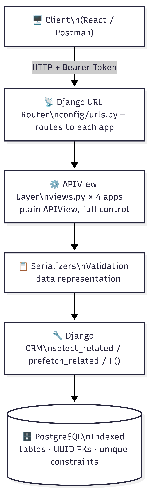
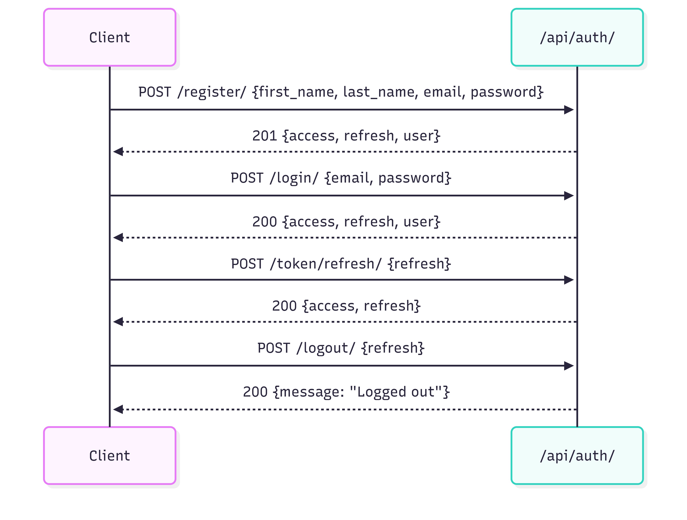

# SocialApp — Django REST Backend

[](https://github.com/harunurrashid97/socialapp)
[](https://python.org)
[](https://djangoproject.com)
[](https://www.django-rest-framework.org/)
[](https://postgresql.org)

A production-ready social feed API built with Django REST Framework + PostgreSQL.

> **GitHub Repository:** https://github.com/harunurrashid97/socialapp

---

## Tech Stack

| Layer | Choice | Reason |
|---|---|---|
| Framework | Django 4.2 + DRF | Mature, batteries-included |
| Auth | JWT via SimpleJWT | Stateless, scalable, refresh rotation |
| DB | PostgreSQL | ACID, strong indexing, JSON support |
| Images | Pillow + Django `ImageField` | Validated uploads, UUID-named files |
| Pagination | Cursor-based | O(1) per page, stable under inserts |

---

## Project Structure

```
socialapp/
├── config/                  # Django project config
│   ├── settings.py          # All settings, env-driven
│   ├── urls.py              # Root URL dispatcher (admin + all app routes)
│   └── wsgi.py
├── apps/
│   ├── users/               # Auth: register, login, logout, me
│   │   ├── models.py        # Custom User (UUID PK, email login)
│   │   ├── serializers.py   # Register, profile, custom JWT serializer
│   │   ├── views.py         # RegisterView, LoginView, LogoutView, MeView
│   │   ├── admin.py         # UserAdmin (email-based)
│   │   ├── urls.py
│   │   └── migrations/
│   ├── posts/               # Posts CRUD + feed
│   │   ├── models.py        # Post (public/private, denorm counters)
│   │   ├── serializers.py   # PostSerializer, PostCreateSerializer
│   │   ├── views.py         # Feed, detail, my posts
│   │   ├── pagination.py    # CursorPagination config
│   │   ├── admin.py
│   │   ├── urls.py
│   │   └── migrations/
│   ├── comments/            # Comments + Replies
│   │   ├── models.py        # Comment, Reply (one-level deep)
│   │   ├── serializers.py
│   │   ├── views.py         # CRUD for comments and replies
│   │   ├── admin.py
│   │   ├── urls.py
│   │   └── migrations/
│   └── interactions/        # Likes (post / comment / reply)
│       ├── models.py        # PostLike, CommentLike, ReplyLike
│       ├── serializers.py   # LikerSerializer
│       ├── signals.py       # Keeps denorm like_count in sync via F()
│       ├── views.py         # Toggle like + likers list for all 3 types
│       ├── admin.py
│       ├── urls.py
│       └── migrations/
├── manage.py
├── requirements.txt
├── .env.example
└── README.md
```

---

## Backend Architecture



### Auth Flow



### Like Counter Flow (race-condition safe)


### Key architectural decisions

**UUID primary keys** — Avoids sequential ID enumeration. A user cannot guess `post/1001` after seeing `post/1000`.

**Denormalized counters** (`like_count`, `comment_count`, `reply_count`) — At millions of posts, running `COUNT(*)` on every feed load is expensive. Counter columns updated atomically via Django signals with `F()` expressions are O(1) reads and race-condition safe.

**Cursor pagination** — Offset pagination degrades to O(n) as page number grows and goes stale when new posts are inserted. Cursor pagination is stable and O(log n) per page.

**Private / public visibility** — Enforced at the queryset level in every view. Private posts are invisible to non-authors even if the UUID is known directly.

**JWT with refresh token rotation + blacklisting** — Each refresh request issues a new token and blacklists the old one, limiting the blast radius of a stolen refresh token.

**One-level replies** — Nested replies create recursive DB queries and complex UI. One level keeps both simple. The `mention` FK provides the "replying to @user" context without true nesting.

**`select_related` / `prefetch_related` throughout** — Every list view avoids N+1 queries. Comment listing prefetches replies and their authors in a single query.

---

## Quick Start

### 1. Install system dependencies

```bash
sudo apt update
sudo apt install python3.10-venv python3-pip postgresql postgresql-contrib -y
sudo systemctl start postgresql
sudo systemctl enable postgresql
```

### 2. Clone & create virtual environment

```bash
git clone https://github.com/harunurrashid97/socialapp.git
cd socialapp/backend
python3 -m venv venv
source venv/bin/activate
pip install -r requirements.txt
```

### 3. Create PostgreSQL database

```bash
sudo -u postgres psql
```
```sql
CREATE DATABASE socialapp_db;
ALTER USER postgres WITH PASSWORD 'yourpassword';
\q
```

### 4. Configure environment

```bash
cp .env.example .env
nano .env
```

Generate a secret key:
```bash
python3 -c "from django.core.management.utils import get_random_secret_key; print(get_random_secret_key())"
```

Fill in `.env`:
```env
SECRET_KEY=<generated-key>
DEBUG=True
DB_NAME=socialapp_db
DB_USER=postgres
DB_PASSWORD=yourpassword
DB_HOST=localhost
DB_PORT=5432
ACCESS_TOKEN_LIFETIME_MINUTES=60
REFRESH_TOKEN_LIFETIME_DAYS=7
```

### 5. Run migrations & create superuser

```bash
python3 manage.py migrate
python3 manage.py createsuperuser
python3 manage.py runserver
```

Server runs at: **http://127.0.0.1:8000**\
Admin panel at: **http://127.0.0.1:8000/admin/**

---

## API Reference

All endpoints require `Authorization: Bearer <access_token>` unless marked **Public**.

### Auth  `/api/auth/`

| Method | Endpoint | Auth | Description |
|--------|----------|------|-------------|
| POST | `/register/` | Public | Create account. Returns tokens + user. |
| POST | `/login/` | Public | Returns access + refresh tokens. |
| POST | `/logout/` | ✓ | Blacklists refresh token. |
| GET | `/me/` | ✓ | Current user profile. |
| PUT | `/me/` | ✓ | Update first/last name. |
| POST | `/token/refresh/` | Public | Rotate refresh token. |

**Register body:**
```json
{
  "first_name": "Alice",
  "last_name": "Smith",
  "email": "alice@example.com",
  "password": "StrongPass123!",
  "password_confirm": "StrongPass123!"
}
```

**Login body:**
```json
{ "email": "alice@example.com", "password": "StrongPass123!" }
```

**Login / Register response:**
```json
{
  "access": "<jwt>",
  "refresh": "<jwt>",
  "user": { "id": "...", "email": "...", "full_name": "Alice Smith" }
}
```

---

### Posts  `/api/posts/`

| Method | Endpoint | Description |
|--------|----------|-------------|
| GET | `/` | Feed: public posts + own private posts, newest first (cursor paginated) |
| POST | `/` | Create post (`multipart/form-data` for image upload) |
| GET | `/mine/` | Own posts only (all visibilities) |
| GET | `/<id>/` | Single post |
| PUT | `/<id>/` | Edit post (author only) |
| DELETE | `/<id>/` | Delete post (author only) |

**Create post fields:** `content` (required), `image` (optional file), `visibility` (`public`|`private`, default `public`)

**Post response shape:**
```json
{
  "id": "uuid",
  "author": { "id": "...", "full_name": "Alice Smith", "email": "..." },
  "content": "Hello world",
  "image": "/media/posts/.../uuid.jpg",
  "visibility": "public",
  "like_count": 12,
  "comment_count": 4,
  "is_liked": false,
  "created_at": "2025-01-01T00:00:00Z",
  "updated_at": "2025-01-01T00:00:00Z"
}
```

**Paginated feed response:**
```json
{
  "next": "cursor_url_or_null",
  "previous": "cursor_url_or_null",
  "results": [ ...posts ]
}
```

---

### Comments  `/api/comments/`

| Method | Endpoint | Description |
|--------|----------|-------------|
| GET | `/posts/<post_id>/` | List comments on a post (oldest first, cursor paginated) |
| POST | `/posts/<post_id>/` | Add comment to post |
| PUT | `/<id>/` | Edit comment (author only) |
| DELETE | `/<id>/` | Delete comment (author only) |
| GET | `/<comment_id>/replies/` | List replies on a comment |
| POST | `/<comment_id>/replies/` | Add reply to comment |
| PUT | `/replies/<id>/` | Edit reply (author only) |
| DELETE | `/replies/<id>/` | Delete reply (author only) |

**Create comment body:** `{ "content": "Nice post!" }`

**Create reply body:**
```json
{ "content": "Agreed!", "mention_id": "<user_uuid_optional>" }
```

---

### Interactions (Likes)  `/api/interactions/`

| Method | Endpoint | Description |
|--------|----------|-------------|
| POST | `/posts/<id>/like/` | Toggle like on a post |
| GET | `/posts/<id>/likers/` | List users who liked a post |
| POST | `/comments/<id>/like/` | Toggle like on a comment |
| GET | `/comments/<id>/likers/` | List users who liked a comment |
| POST | `/replies/<id>/like/` | Toggle like on a reply |
| GET | `/replies/<id>/likers/` | List users who liked a reply |

**Like toggle response:**
```json
{ "liked": true, "like_count": 13 }
```

**Likers response:**
```json
[
  { "id": "uuid", "full_name": "Bob Jones", "email": "bob@example.com" }
]
```

---

## Testing with Postman

### Step 1 — Setup Postman Environment

1. Open Postman → click **Environments** (top right) → **New Environment**
2. Name it `SocialApp Local`
3. Add these variables:

| Variable | Initial Value |
|----------|--------------|
| `base_url` | `http://127.0.0.1:8000` |
| `access_token` | *(leave blank)* |
| `refresh_token` | *(leave blank)* |

4. Click **Save** and select this environment from the top-right dropdown

---

### Step 2 — Auto-save tokens after login

In your **Login** or **Register** request, go to the **Tests** tab and paste:

```javascript
const res = pm.response.json();
pm.environment.set("access_token", res.access);
pm.environment.set("refresh_token", res.refresh);
```

This automatically saves tokens so every other request picks them up.

---

### Step 3 — Set Bearer token globally

1. Create a **Collection** called `SocialApp`
2. Click the collection → **Authorization** tab
3. Set Type to **Bearer Token**
4. Set Token to `{{access_token}}`

Now every request inside this collection automatically sends the token.

---

### Step 4 — Test each endpoint

#### Register (Public)
```
POST  {{base_url}}/api/auth/register/
Body → raw → JSON:
{
  "first_name": "Alice",
  "last_name": "Smith",
  "email": "alice@example.com",
  "password": "StrongPass123!",
  "password_confirm": "StrongPass123!"
}
```
Expected: `201 Created` with `access`, `refresh`, `user`

---

#### Login (Public)
```
POST  {{base_url}}/api/auth/login/
Body → raw → JSON:
{
  "email": "alice@example.com",
  "password": "StrongPass123!"
}
```
Expected: `200 OK` with `access`, `refresh`, `user`

---

#### Get My Profile
```
GET  {{base_url}}/api/auth/me/
Authorization: Bearer {{access_token}}   ← auto from collection
```
Expected: `200 OK` with user object

---

#### Create Post (text only)
```
POST  {{base_url}}/api/posts/
Body → raw → JSON:
{
  "content": "Hello world!",
  "visibility": "public"
}
```
Expected: `201 Created` with full post object

---

#### Create Post (with image)
```
POST  {{base_url}}/api/posts/
Body → form-data:
  content    →  Hello with image!
  visibility →  public
  image      →  [File] select an image from your computer
```
Expected: `201 Created` — `image` field will contain the media URL

---

#### Get Feed
```
GET  {{base_url}}/api/posts/
```
Expected: `200 OK` with `{ next, previous, results: [...] }`
Use the `next` cursor URL to load the next page.

---

#### Get Single Post
```
GET  {{base_url}}/api/posts/<post_id>/
```
Copy a `id` from the feed response and paste it in the URL.

---

#### Add Comment
```
POST  {{base_url}}/api/comments/posts/<post_id>/
Body → raw → JSON:
{ "content": "Great post!" }
```
Expected: `201 Created`

---

#### Add Reply
```
POST  {{base_url}}/api/comments/<comment_id>/replies/
Body → raw → JSON:
{ "content": "Totally agree!" }
```
Expected: `201 Created`

---

#### Like a Post
```
POST  {{base_url}}/api/interactions/posts/<post_id>/like/
```
Expected: `200 OK` → `{ "liked": true, "like_count": 1 }`
Call again to unlike → `{ "liked": false, "like_count": 0 }`

---

#### See Who Liked a Post
```
GET  {{base_url}}/api/interactions/posts/<post_id>/likers/
```
Expected: `200 OK` → array of user objects

---

#### Refresh Token
```
POST  {{base_url}}/api/auth/token/refresh/
Body → raw → JSON:
{ "refresh": "{{refresh_token}}" }
```
Expected: `200 OK` with new `access` and `refresh` tokens

---

#### Logout
```
POST  {{base_url}}/api/auth/logout/
Body → raw → JSON:
{ "refresh": "{{refresh_token}}" }
```
Expected: `200 OK` → `{ "message": "Logged out successfully." }`

---

### Step 5 — Test private post visibility

1. Register two users: `alice@example.com` and `bob@example.com`
2. Login as Alice → create a post with `"visibility": "private"`
3. Copy the post `id`
4. Login as Bob (tokens auto-update via Tests script)
5. Try `GET {{base_url}}/api/posts/<alice_private_post_id>/`
6. Expected: `404 Not Found` — Bob cannot see Alice's private post
7. Login back as Alice → same request → Expected: `200 OK`

---

### Common errors & fixes

| Error | Cause | Fix |
|-------|-------|-----|
| `401 Unauthorized` | Missing or expired token | Login again, check `{{access_token}}` is set |
| `403 Forbidden` | Trying to edit another user's post | Use the correct user's token |
| `404 Not Found` | Private post or wrong UUID | Check visibility and post ownership |
| `400 Bad Request` | Validation error | Read the `errors` field in response body |
| `415 Unsupported Media Type` | Sending JSON for image upload | Switch Body to `form-data` for image posts |
